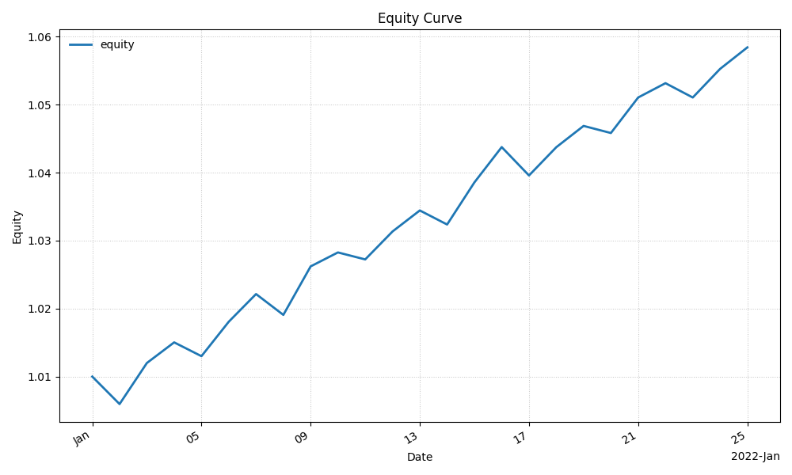
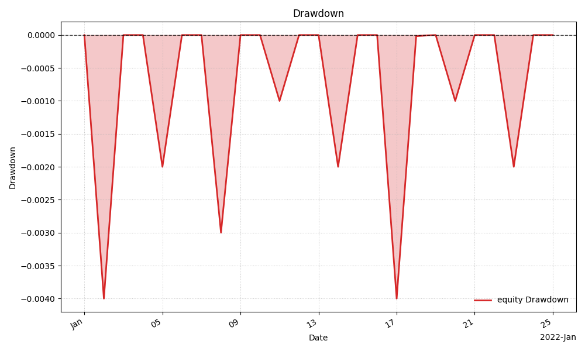
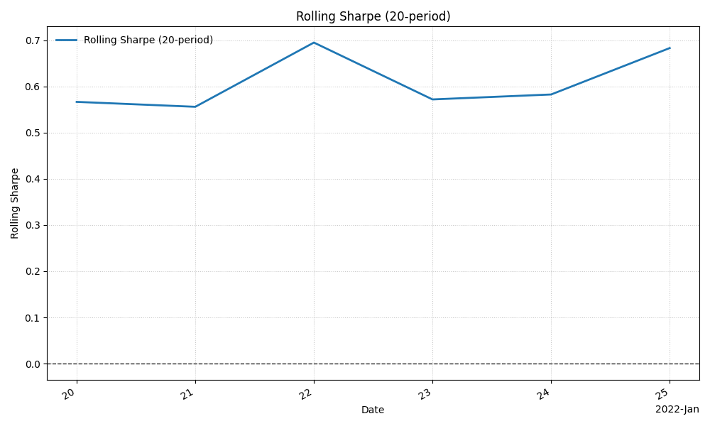
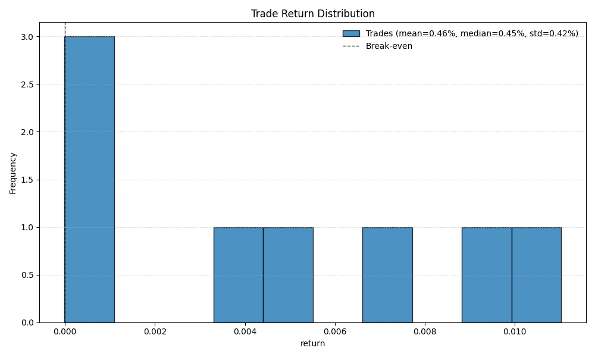
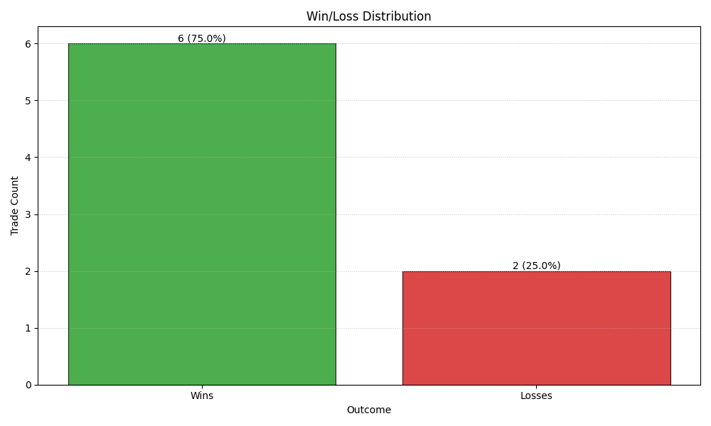

# Strategy Report: momentum

| Field | Value |
| --- | --- |
| Strategy | momentum |
| Run ID | momentum_single_f21f38f699e8 |
| Evaluation Mode | Single |
| Timeframe | 1D |
| Date Range | 2022-01-01T00:00:00Z to 2022-01-25T00:00:00Z |

## Run Configuration Summary
| Field | Value |
| --- | --- |
| Dataset | features_daily |
| Parameters | lookback=20, threshold=0.5 |
| Primary Metric | sharpe ratio |

## Key Metrics
| Metric | Value |
| --- | --- |
| Sharpe | 0.410 |
| Total Return | 0.98% |
| Cumulative Return | 0.98% |
| Max Drawdown | 5.00% |
| Volatility | 1.20% |
| Annualized Return | 19.00% |
| Annualized Volatility | 21.00% |
| Win Rate | 50.00% |
| Profit Factor | 1.100 |
| Turnover | 0.330 |
| Exposure | 66.70% |

## Visualizations
### Performance Overview

### Rolling Diagnostics

### Trade Summary

| Metric | Value |
| --- | --- |
| Trade Count | 8 |
| Winning Trades | 6 |
| Losing Trades | 2 |
| Win Rate | 75.00% |
| Loss Rate | 25.00% |
| Mean Return | 0.46% |
| Median Return | 0.45% |
| Std Return | 0.42% |

### Trade Diagnostics

## Interpretation
- The run finished with a positive total return of 0.98%. Sharpe was 0.410.
- Peak-to-trough drawdown reached 5.00%, which frames the downside seen in the equity and drawdown plots.
- Trade diagnostics cover `8` closed trades. Win rate was 50.00%.

## Artifact References
- [manifest.json](manifest.json)
- [config.json](config.json)
- [metrics.json](metrics.json)
- [equity_curve.csv](equity_curve.csv)
- [signals.parquet](signals.parquet)
- [trades.parquet](trades.parquet)
- [plots/](plots)
- [drawdown.png](plots/drawdown.png)
- [equity_curve.png](plots/equity_curve.png)
- [rolling_sharpe.png](plots/rolling_sharpe.png)
- [trade_return_distribution.png](plots/trade_return_distribution.png)
- [win_loss_distribution.png](plots/win_loss_distribution.png)
