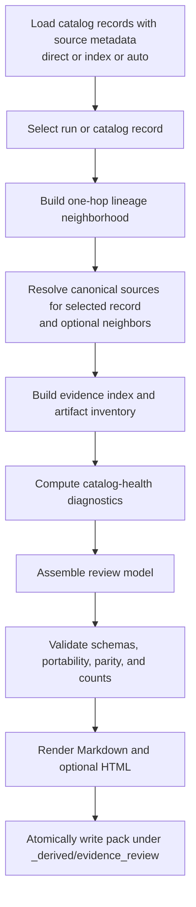
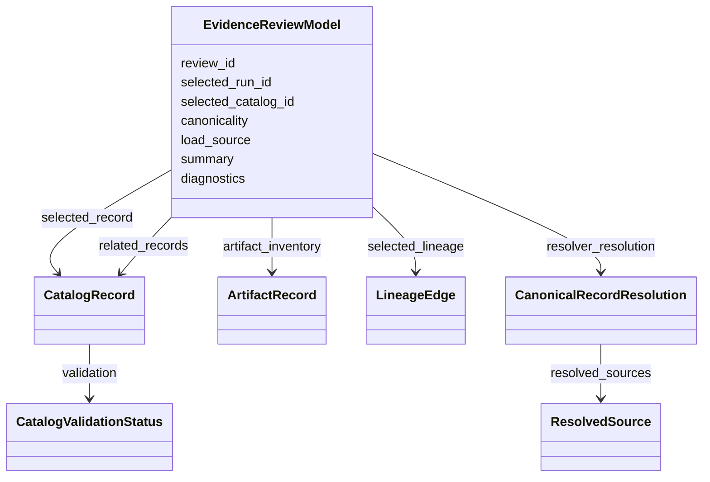

# Static Evidence Review Packs and Catalog Health Diagnostics for stratlake-trade-engine

## Executive summary

This report develops an M38 proposal as a **composition milestone**, not a new subsystem. The repository already has most of the primitives M38 needs: a deterministic read-only catalog and artifact model, an optional disposable SQLite index, deterministic OpenLineage-style and PROV-style exports, evidence-view renderers, `load_source.v1`, Canonicality Envelope v1, resolver-first canonical reopening, notebook/CLI workflow helpers, and architecture guardrails that keep derived outputs non-authoritative. The most valuable M38 work is therefore to package those capabilities into a **selected-run static evidence review bundle** plus a **conservative catalog-health diagnostic layer**, while preserving the current M37 rule that direct artifact scans remain canonical and `_derived` outputs remain disposable. [1, 2, 3, 4, 9, 6]

The recommended default output is a pack under `artifacts/_derived/evidence_review/<review_id>/` containing machine-readable review payloads, a resolver-backed canonical-source summary, selected-run lineage exports, catalog-health findings, a manifest, and static human-readable reports. The pack should be **derived, non-authoritative, and rebuildable**, with authority always remaining in canonical manifests, registries, markers, summaries, and other artifact-tree files. This matches the repository’s existing review-bundle pattern in regime review packs and governance reporting, and it fits M37’s explicit `_derived` namespace and resolver-first doctrine. [13, 14, 4, 5]

The cleanest implementation is **Python-first, CLI second**. Concretely, M38 should add a pure builder API in `src.catalog`, plus a thin writer and a thin `argparse` CLI wrapper that reuse the same underlying workflow path. That recommendation is strongly aligned with the repo’s current public facade, shared workflow helpers, notebook ergonomics, CLI/API parity tests, and the fact that the project already uses stdlib-style CLI code and JSON-safe return payloads rather than introducing richer CLI frameworks or notebook-only logic. [1, 2, 15, 16, 17]

For validation and determinism, M38 should stay on the project’s existing contract machinery: JSON payloads validated with Draft 2020-12 JSON Schema through the existing `src/contracts/validate.py`, stable ordering inherited from catalog and lineage layers, portable repository-relative paths only, canonical JSON hashing where fingerprints are required, atomic write semantics, and CI-safe synthetic fixtures. External standards point in the same direction: OpenLineage explicitly supports design-time lineage events, PROV-DM formalizes provenance bundles and provenance-of-provenance, JSON Schema 2020-12 supports compound schema documents, RFC 8785 explains why invariant JSON serialization matters for repeatable cryptographic hashes, and ACM’s artifact-review guidance emphasizes independent auditability and reusable review-ready artifacts. [20, 23, 24, 25, 26, 27]

The highest-confidence roadmap is a six-workstream plan: contract extension, selected-run review builder, catalog-health diagnostics, report renderers and pack writer, CLI/docs/examples, and deterministic validation plus guardrail updates. The heaviest tasks are the diagnostics engine and the combined deterministic validation slice; most other work is medium effort because the repo already provides the underlying catalog, lineage, resolver, and rendering substrate. [6, 18]

## Repository baseline and external anchors

The repository’s current evidence stack is already unusually close to what M38 needs. `src.catalog` publicly exposes catalog construction, derived-index loading and validation, explorer rendering, lineage export, resolver APIs, and workflow helpers; M36 added the optional disposable SQLite index, OpenLineage-style and PROV-style exports, and shared workflow helpers; M37 then hardened that stack with Canonicality Envelope v1, `load_source.v1`, the `_derived` namespace default, resolver-first canonical reopening, and architecture guardrails. The resulting architecture boundary is explicit: direct scan is canonical and default, while indexes, exports, explorer views, and workflow views are derived read models only. [1, 4, 5]

The current code also gives M38 a strong selected-subject baseline. The lineage exporter already supports `selected_run_id` and intentionally emits only the selected run and its direct one-hop neighborhood, while the evidence explorer can render deterministic JSON, Markdown, and tabular text for either query-based views or selected-run views expanded through lineage edges. That means M38 does not need to invent selection semantics from scratch; it can reuse the repo’s existing one-hop model and add resolver-backed source reopening plus diagnostics and pack writing on top. [12, 11]

The repository also has **bundle precedents** that matter. M26 regime review packs already write a mixture of ranked CSV/JSON outputs, an `evidence_index.json`, a `review_summary.json`, a `manifest.json`, and an optional `report.md`. M32 governance reporting similarly writes a deterministic bundle containing JSON summaries, CSV matrices, a Markdown report, validation evidence, and a manifest. Those milestones show that StratLake already treats “review-ready bundle with machine and human outputs” as a familiar artifact pattern. M38 should therefore look like a new evidence-pack specialization, not a new platform concept. [13, 14]

The external standards and papers reviewed here point in the same direction. OpenLineage’s object model explicitly distinguishes **runtime** `RunEvent` from **design-time** `JobEvent` and `DatasetEvent`, which supports M38’s static-review posture rather than any run replay or service dependency. PROV-DM defines provenance as information about entities, activities, and agents, and explicitly includes **bundles** for provenance-of-provenance. JSON Schema Draft 2020-12 is the current official schema family already used by the repo, and it includes support for schema bundling. RFC 8785 explains why deterministic JSON canonicalization matters whenever repeatable hashing is needed. ACM’s artifact-review guidance defines artifacts broadly as code, data, scripts, and generated outputs, and argues for independent auditability. RO-Crate is a useful interoperability reference, but it is a substantially heavier metadata model than what the repo currently uses. ReproServer and the NeurIPS reproducibility-program report both reinforce the value of lowering friction for reviewers and standardizing reproducibility evidence, which is exactly what a static evidence review pack should do. [23, 24, 25, 26, 27, 28, 29, 30]

The practical implication is straightforward: M38 should remain a **local, static, derived review bundle** that is easy to build, easy to diff, easy to validate, and easy to discard, while still being rich enough to help a reviewer answer three questions: *what was reviewed, what canonical sources support it, and how healthy is the surrounding catalog context?* That is more than enough value for this milestone; anything involving a service, remote metadata backend, inferred lineage, or a new source of truth would cut directly against the repo’s current boundary. [4, 5, 6]

## Recommended M38 architecture

The recommended M38 design introduces a new derived artifact family, a new workflow helper, and a new static bundle writer, while preserving current catalog semantics. One important implementation detail is that M37’s current `DerivedClass` enum only includes `sqlite_read_model`, `lineage_export`, `evidence_view`, and `workflow_view`, and the M37 design note explicitly says `workflow_view` is reserved for a future wrapper-level payload. M38 should therefore extend canonicality metadata with a new `derived_class: review_pack` rather than overloading `evidence_view` or misusing `workflow_view`. The same logic applies to `load_source.v1`: the current `loaded_from` values stop at `workflow_view`, so M38 should add a dedicated `review_pack` or `evidence_review` source classification. [7, 8, 4]

A strong M38 definition of done is shown below.

| Goal | Concrete success criterion |
| --- | --- |
| Preserve artifact-first authority | Creating or deleting a review pack does not change canonical catalog identity or mutate canonical source files |
| Stay resolver-backed | Pack includes canonical-source reopening results for the selected subject, with `resolved`, `partial`, or `unresolved` status |
| Remain deterministic | Repeated runs over unchanged canonical sources produce identical JSON payloads and report bodies, modulo an explicitly caller-supplied output path |
| Remain portable | Pack metadata contains no absolute paths, `file://` URIs, parent traversal, or backslashes |
| Keep selection simple | Default scope is selected record plus direct one-hop lineage neighborhood only |
| Stay Python-first | Pure builder API is the source of truth; CLI is a thin wrapper with exit codes and file writing |
| Stay CI-safe | Example script uses temporary synthetic artifacts only and requires no network, credentials, or live data |
| Stay non-authoritative | Every derived JSON artifact carries canonicality and load-source metadata; Markdown and HTML include a visible non-authoritative banner |

The default pack layout should be explicit, stable, and small enough to inspect manually:

```text
artifacts/_derived/evidence_review/<review_id>/
  manifest.json
  review_request.json
  review_summary.json
  catalog_health_diagnostics.json
  validation.json
  selected_record.json
  related_records.json
  resolver_resolution.json
  evidence_index.json
  artifact_inventory.csv
  selected_lineage.openlineage.json
  selected_lineage.prov.json
  report.md
  report.html
```

That layout is intentionally close to the repository’s existing review/report bundle patterns: `manifest.json` as the inventory spine, `review_summary.json` as the compact machine-readable landing artifact, `evidence_index.json` as the source-to-section map, CSV for spreadsheet-friendly inspection, JSON for automation, and Markdown/HTML for human review. The only output that should be optional by default is `report.html`; the repo’s surfaced materials strongly favor Markdown, JSON, CSV, and plain text rather than HTML-first reporting. [13, 14, 11]

A good top-level generation flow looks like this:



That flow is not hypothetical; it is deliberately composed from current repository pieces. The loader already distinguishes direct/index/auto modes, the exporter already has one-hop selected-run semantics, the resolver already reopens canonical files with `artifacts_root` containment checks, and the existing deterministic validation slices already enforce portability, disposability, and repeated-run parity. M38’s main architectural move is to **compose** those pieces into one review model and split that model into bundle files. [3, 12, 9, 18]

The default `review_id` should also be deterministic when the caller does not provide one. A practical pattern is to compute a short fingerprint from the normalized request shape — selected run/catalog id, index mode, explicit index path if any, whether neighbor resolution is enabled, and requested formats — and then derive a slug such as `strategy_000_9b2f7d8a`. That keeps the pack path stable across repeated runs without needing wall-clock timestamps, and it aligns with the repo’s broader preference for deterministic artifact identity. RFC 8785 is the right conceptual anchor for the request fingerprint step because it exists precisely to make JSON serialization invariant for repeatable hashing. [7, 10, 26]

## Contracts, diagnostics, and report formats

The repo already has the core data types M38 needs. `CatalogRecord` exposes the selected record’s identity, source registry/manifest/marker paths, optional evidence-family fields, `source_files`, and structured validation status. `ArtifactRecord` captures per-file inventory information such as `artifact_type`, `relative_path`, `declared_in_manifest`, size, and schema hints. `LineageEdge` provides deterministic relationships with stable IDs and relationship metadata. The repo’s contract utility already validates JSON using `Draft202012Validator`, so M38 should use that existing pattern rather than introducing a new validation stack. [10, 20, 25]

A clean review model can be represented conceptually as follows:



For schema strategy, the best choice is to keep the repo’s current JSON Schema approach and reserve Python-only checks for cross-file invariants.

| Validation contract option | Strengths | Weaknesses | Recommendation |
| --- | --- | --- | --- |
| JSON Schema Draft 2020-12 plus current `validate_json` utility | Already in the repo, externally legible, good for machine validation, versionable, works well with deterministic JSON artifacts | Needs separate code for cross-file parity checks | **Use as the primary contract layer** |
| Python-only dataclass or ad hoc assertion checks | Cheap to start, expressive for cross-file rules | Weak interoperability, easy to drift, harder to document externally | Use only for parity and invariants that span files |
| RO-Crate/JSON-LD profile as the primary schema model | Strong scholarly interoperability and packaging story | Too heavy for current repo style, introduces JSON-LD semantics the repo does not otherwise use | Defer to a future interoperability milestone, not M38 core |

That recommendation follows directly from the repo’s existing `jsonschema` dependency and `Draft202012Validator` usage, plus JSON Schema’s current Draft 2020-12 status. RO-Crate is useful to keep in mind as a future export route, but not as the native M38 contract model. [19, 20, 25, 28]

The pack itself should use a small, explicit schema family, for example:

```text
evidence_review_request.schema.json
evidence_review_summary.schema.json
catalog_health_diagnostics.schema.json
resolver_resolution_bundle.schema.json
evidence_index.schema.json
evidence_review_validation.schema.json
```

A representative `review_summary.json` should include at least: `schema_version`, `artifact_kind`, `review_id`, `selected_run_id`, `selected_catalog_id`, `review_scope`, `resolver_status`, `overall_health_status`, `record_count`, `artifact_count`, `lineage_edge_count`, `finding_counts`, `canonicality`, and `load_source`. The `manifest.json` should inventory all generated files, their digests, their schema names where applicable, and the specific canonical source paths and fingerprints used to build the pack. That keeps the pack self-describing without turning it into a second registry. The “source of truth” remains the canonical source files themselves, and the pack merely names them and summarizes them. [4, 14, 13]

For catalog-health diagnostics, the most useful implementation is a **rule-and-metric hybrid**: a set of conservative checks with `PASS`, `WARN`, `FAIL`, or `NA`, plus quantitative counters and ratios. The severity vocabulary is a good fit for the repository because M30 already exposes advisory diagnostics grouped into `PASS`, `WARN`, and `FAIL`, while M32 also uses structured validation findings rather than recomputing policy. M38 diagnostics should follow that same advisory stance: they are review context, not enforcement. [21, 14]

A practical first rule set is below.

| Check ID | Scope | Detection rule | Default severity |
| --- | --- | --- | --- |
| `selected_record_found` | Subject | Missing selected run/catalog record | FAIL |
| `resolver_status` | Subject | `resolved` = PASS, `partial` = WARN, `unresolved` = FAIL | PASS/WARN/FAIL |
| `source_path_portability` | Subject + neighbors | Any absolute path, URI-like path, backslash, or `..` in canonical-source metadata | FAIL |
| `artifacts_root_containment` | Subject + neighbors | Any resolved source path escapes `artifacts_root` | FAIL |
| `manifest_presence` | Subject + neighbors | `manifest_status == missing` | FAIL |
| `declared_artifact_integrity` | Subject + neighbors | Any `manifest_artifact_missing:*` warning or incomplete artifact status | FAIL |
| `undeclared_artifacts_present` | Subject + neighbors | Any `undeclared_artifact:*` warning | WARN |
| `registry_linkage` | Subject + neighbors | Registry-backed record missing registry entry | WARN |
| `marker_conflict_or_instability` | Subject + neighbors | Multiple conflicting markers, running-only status, or failed marker present | WARN |
| `canonicality_compatibility` | Inputs | Imported derived payload marked `legacy_no_envelope` | WARN |
| `derived_authority_leak` | Pack | Any canonical authority path points into `_derived/` | FAIL |
| `lineage_selection_closure` | Pack | Selected lineage export missing selected node or contains broken relations | FAIL |
| `render_parity` | Pack | Markdown/HTML summary counts disagree with JSON summary | FAIL |
| `schema_validation` | Pack | Any JSON artifact violates its declared schema | FAIL |

Those checks are intentionally grounded in existing re-usable primitives: `CatalogValidationStatus`, warning codes such as `manifest_artifact_missing` and `undeclared_artifact`, marker precedence, path-portability validation, canonicality status, `load_source`, and resolver statuses. M38 should not invent a second diagnostic ontology when the repo already has these structured signals. [10, 8, 9, 6]

The human-readable report-format decision is also fairly clear.

| Report format | Best use | Strengths | Main tradeoff |
| --- | --- | --- | --- |
| Markdown | Default human-readable artifact | Repo-native, diffable, easy to review on GitHub, consistent with existing docs/report bundles | Limited layout richness |
| Single-file HTML | Optional secondary report | Easier navigation, color-coded health statuses, collapsible sections, still static | More renderer and escaping work |
| JSON summary only | Automation, CI, downstream tooling | Best machine contract | Not enough for human review |
| RO-Crate package | Future interoperability export | Good external packaging story | Too heavy for the repo’s current local derived-view architecture |

The recommendation is to make **Markdown mandatory**, **JSON mandatory**, and **HTML optional**. That follows the current repo pattern: regime review packs and governance reports already rely on Markdown plus machine-readable companions, while the evidence explorer renders deterministic Markdown, JSON, and tab-separated text; there is no surfaced evidence that HTML is currently a standard report artifact in this repo. RO-Crate should be treated as a future export or adapter question, not the native pack format. [13, 14, 11, 28]

A good `report.md` section order would be:

```text
# Evidence Review <review_id>

Derived review pack. Non-authoritative. Reopen canonical manifests and registries before decision-sensitive use.

## Review Subject
## Resolver Summary
## Catalog Health
## Related Records
## Artifact Inventory
## Selected Lineage
## Evidence Index
## Validation Results
## Canonical Source Paths
```

That sectioning mirrors the explorer’s existing visible warning banner and fixed deterministic section layout, but adds the resolver and validation material that M38 specifically needs. [11]

## API, determinism, and test strategy

Python should remain the source of truth for M38 because that is how the repo already treats shared workflow behavior. `load_catalog_for_workflow`, `build_lineage_export_for_workflow`, and `build_evidence_view_for_workflow` are already thin, reusable building blocks for CLI, notebooks, and wrappers; notebook ergonomics docs explicitly state that helpers reuse the same underlying logic rather than creating notebook-only paths; and parity tests already compare CLI and Python behavior over the same shared helpers. M38 should extend that pattern instead of introducing a CLI-led implementation. [2, 16, 17]

A Python-first surface that fits the repo’s style would look like this:

```python
from __future__ import annotations

from dataclasses import dataclass
from pathlib import Path
from typing import Any, Literal, Sequence

IndexMode = Literal["direct", "index", "auto"]
LineageFormat = Literal["openlineage", "prov", "both"]

@dataclass(frozen=True)
class EvidenceReviewWriteResult:
    review_id: str
    output_dir: str
    report_md_path: str
    report_html_path: str | None
    summary_path: str
    diagnostics_path: str
    validation_path: str

def build_catalog_health_diagnostics(
    records: Sequence[Any],
    *,
    selected_run_id: str | None = None,
    selected_catalog_id: str | None = None,
    repo_root: str | Path | None = None,
) -> dict[str, Any]:
    ...

def build_evidence_review_for_workflow(
    artifacts_root: str | Path,
    *,
    repo_root: str | Path | None = None,
    index_path: str | Path | None = None,
    index_mode: IndexMode = "direct",
    selected_run_id: str | None = None,
    selected_catalog_id: str | None = None,
    review_id: str | None = None,
    resolve_related: bool = False,
    include_html: bool = False,
    lineage_format: LineageFormat = "both",
) -> dict[str, Any]:
    ...

def write_evidence_review_pack(
    review: dict[str, Any],
    *,
    output_dir: str | Path | None = None,
) -> EvidenceReviewWriteResult:
    ...

def validate_evidence_review_pack(
    review_dir: str | Path,
    *,
    repo_root: str | Path | None = None,
) -> dict[str, Any]:
    ...
```

That shape is intentionally conservative. It matches the repo’s existing preference for pure builder functions returning JSON-safe dictionaries, plus thin CLIs and explicit validation helpers. It also avoids adding a new dependency surface: the repo currently depends on `jsonschema`, `pytest`, and `ruff`, not on Click, Typer, Rich, or Jinja2, and the current CLI modules are all stdlib `argparse` wrappers. [19, 15]

The thin CLI should mirror current conventions and preferably use subcommands:

```bash
python -m src.cli.build_evidence_review build \
  --artifacts-root artifacts \
  --run-id strategy_000 \
  --index artifacts/_derived/catalog_index/catalog_index.sqlite \
  --index-mode auto \
  --output-dir artifacts/_derived/evidence_review/strategy_000_9b2f7d8a \
  --html

python -m src.cli.build_evidence_review validate \
  --review-dir artifacts/_derived/evidence_review/strategy_000_9b2f7d8a \
  --repo-root .
```

The CLI/API split should stay crisp:

| Capability | Python API | CLI | Recommendation |
| --- | --- | --- | --- |
| Interactive notebook review | Excellent | Awkward | API-first |
| CI automation and exit codes | Good | Excellent | CLI wrapper |
| Structured access to findings and rows | Excellent | Limited unless JSON piped | API-first |
| Simple pack creation from shell | Good | Excellent | CLI wrapper |
| Reuse in future wrappers | Excellent | Limited | API-first |
| Validation of an existing pack on disk | Good | Excellent | CLI wrapper with exit code |
| Testability of core logic | Excellent | Medium | API-first |

For determinism, M38 should explicitly inherit the current repo’s strongest practices. Catalog records are already sorted deterministically; artifact records are already sorted by relative path; lineage edges already have stable IDs and ordering; `load_source` and canonicality metadata are already normalized; and current portability tests already assert that serialized outputs contain no temp paths, `file://` URIs, backslashes, or parent traversal. M38 should therefore do four things: build the review model once, sort every row and finding before render, use canonical JSON for hash inputs, and render Markdown/HTML from that same in-memory model so parity checks are meaningful. [10, 8, 7, 18]

The writer should also follow the repo’s current safety pattern. `build_derived_index` already writes through a temporary file and only then replaces the target; M38 should do the directory analogue: write the whole pack into a temporary sibling directory and then atomically rename it into place. That makes failed writes easy to clean up and avoids partially-written packs appearing valid. It also fits the repo’s broader portability and release-hardening stance. [3, 4]

The CI-safe test plan should be explicit from the start:

```text
tests/test_evidence_review_pack.py
tests/test_catalog_health_diagnostics.py
tests/test_evidence_review_cli.py
tests/test_m38_deterministic_validation.py
docs/examples/m38_static_evidence_review_pack_example.py
```

The focused slice should exercise repeated-run determinism, direct/index/auto parity, missing/stale index behavior, one-hop selected-run semantics, resolver `resolved/partial/unresolved` cases, legacy no-envelope compatibility, portability of every serialized artifact, HTML/Markdown/JSON summary parity, and the guarantee that pack creation does not mutate canonical artifacts. The example should follow the existing M37 pattern: temporary synthetic artifacts only, no credentials, no network, no live data, and no repository-artifact mutation. It should then be wired into the milestone checklist alongside docs/path lint, package build validation, and the broader milestone validation bundle. [6, 18, 17]

## Compatibility, security, and performance

M38 must be explicitly compatible with M37’s artifact-first guarantees. The safest framing is not “new review authority,” but “derived static review pack over canonical artifacts.” That means: default output under `_derived`, direct scan still canonical and default, resolver-first reopening before decision-sensitive use, legacy no-envelope inputs still readable but visibly marked, no write-back into canonical artifacts, and no change to promotion or governance decisions. Current M37 docs and tests go out of their way to make those boundaries executable; M38 should preserve them, not reinterpret them. [4, 5, 6, 18]

A compact compatibility map is below.

| Current guarantee | M38-compatible behavior |
| --- | --- |
| Direct scan is canonical | Review pack loads from direct by default and records `load_source` |
| `_derived` is disposable | Review packs live only under `_derived/evidence_review` |
| Resolver is the bridge back to authority | Pack includes resolver output and repeats its warning/status model |
| Legacy no-envelope derived payloads remain readable | Pack surfaces compatibility warnings but does not silently promote them |
| Consequential consumers must defer to canonical files | Report banner and manifest must say so plainly |
| Decision-authority modules must not import derived read models | Extend guardrail tests to include the new M38 module |

One subtle but important security point is that the resolver’s current path safety rules are already strong enough to reuse directly. It normalizes to portable repository-relative paths, rejects non-portable paths, rejects repo-relative paths outside `artifacts_root`, refuses to reopen missing files, and reports warnings instead of silently trusting suspicious references. M38 should reuse that behavior for both subject resolution and pack validation. It should also extend current output-safety rules to HTML rendering: HTML-escape all user-controlled strings, never embed external assets or runtime JavaScript by default, and never inline raw binary contents. For fingerprints, use SHA-256 over canonical JSON or raw bytes as appropriate, because repeatable hashing depends on invariant serialization. [9, 8, 6, 18, 26]

Reproducibility considerations should stay conservative. The pack should not record wall-clock generation timestamps inside deterministic payloads; if time needs to be tracked, it can live in optional non-deterministic runtime logs outside the contract boundary. Generated JSON should use sorted keys and LF line endings. Markdown and HTML should be pure renderings of the same underlying model, not separately assembled summaries. Generated file digests belong in the pack’s own manifest, but **canonicality fingerprints must remain fingerprints of canonical sources**, not of the derived report itself; otherwise the pack would start to look authoritative in exactly the way M37 is designed to avoid. [7, 18, 15]

Performance should be guided by the current M36/M37 split between direct correctness and optional acceleration. The repo already treats the SQLite index as disposable and safe only when validated, with `auto` falling back to direct scan only when the index is absent and not when it is stale or incompatible. M38 should inherit that behavior wholesale. For larger artifact trees, the right default is: use the validated index to load catalog records, compute a selected one-hop neighborhood, and then use the resolver only for the selected record by default, with neighbor resolution behind an option. That keeps the expensive “reopen canonical files” step tightly scoped without weakening correctness. [3, 17, 4]

One last compatibility detail matters for guardrails: once M38 adds a new derived module such as `src.catalog.evidence_review`, the architecture test suite should treat it the same way it already treats derived index, lineage export, explorer, and workflow helper modules. In other words, decision-authority modules should still be allowed to import resolver APIs, but they should **not** import M38 review-pack builders or writers. That way the review pack remains review context rather than silently becoming an authority input. [6]

## Roadmap and effort

The surfaced materials do specify some implementation assumptions and leave others open. What is **known** is that the package currently declares `requires-python >=3.10`, GitHub Actions currently runs a 3.11 matrix on Ubuntu, Windows, and macOS, milestone validation triggers on `feature/m*`, and releases remain tag-driven on `v*`. The repo also already uses Draft 2020-12 JSON Schema validation through `src/contracts/validate.py`. What is **not specified** in the reviewed materials is any existing M38 issue numbering scheme, any required HTML-report policy, or any mandatory schema-directory naming convention for new review-pack schema files. Those should be treated as open implementation decisions, not as assumed facts. [19, 20]

Using `Low`, `Medium`, and `High` as relative effort estimates within the repo’s current style, the roadmap is:

| Workstream | Deliverables | Effort | Why |
| --- | --- | --- | --- |
| Contract extension | Add `review_pack` derived class, add new `load_source` kind, define `review_summary`, diagnostics, evidence-index, and validation schema family | Medium | Localized but cross-cutting metadata changes |
| Review builder core | `build_evidence_review_for_workflow`, one-hop subject selection, resolver integration, evidence-index assembly, deterministic review-id logic | High | This is the milestone’s main composition layer |
| Catalog-health diagnostics | Rule engine, aggregate counters, PASS/WARN/FAIL/NA model, pack-level parity checks | High | Needs careful scope and non-authoritative semantics |
| Pack writer and renderers | Atomic pack writer, Markdown renderer, optional self-contained HTML renderer, manifest + digests | Medium | Straightforward once the model stabilizes |
| CLI, docs, and example | `argparse` CLI with build/validate subcommands, docs page, example script, README/docs linkage | Medium | Mostly thin wrapper and documentation work |
| Validation and guardrails | Focused test slice, deterministic validation, portability checks, CLI/API parity, guardrail extension, milestone checklist updates | High | High leverage and essential for safe merge/release |

If you want to split that into milestone-sized issues or PRs, the most coherent order is:

| Recommended sequence | Scope | Effort |
| --- | --- | --- |
| Review-contract skeleton | Metadata enums, schemas, empty builder stubs, manifest structure | Medium |
| Selected-run review builder | Selection, lineage neighborhood, resolver-backed subject summary, JSON outputs without renderers | High |
| Diagnostics and evidence index | Health findings, counters, cross-file parity rules, CSV inventory | High |
| Renderers and CLI | Markdown, optional HTML, CLI wrapper, docs/examples | Medium |
| Integrated deterministic validation | Focused tests, portability, parity, stale-index and legacy-input coverage, guardrail updates | High |
| Merge and release hardening | Milestone checklist updates, docs/path lint, package build, workflow validation | Low |

Before implementation begins, the repo checks worth making explicit are simple: confirm the milestone branch slug you want to use under the current `feature/m*` convention, confirm whether the new schema files should live beside existing contract helpers or in a dedicated evidence-review schema subtree, confirm whether HTML should be on by default or behind a flag, and confirm whether the first version should resolve only the selected subject or also resolve one-hop neighbors by default. Those are design choices, not blockers, but deciding them early will reduce churn in tests and docs. [19, 6]

Overall, the recommended implementation posture is disciplined and incremental: **add one new derived artifact family, reuse the current resolver and workflow substrate, keep JSON Schema as the contract backbone, default to Markdown plus machine-readable sidecars, and treat catalog health as advisory review context rather than a new policy engine**. That is the most faithful M38 interpretation of the repository’s current architecture and the lowest-risk way to make review evidence materially more useful. [4, 2, 20, 23, 24, 26, 27]

## Bibliography

[1] **StratLake Trade Engine repository source snapshot.** `src.catalog` public facade and catalog/evidence stack reviewed for M38 planning.

[2] **StratLake Trade Engine repository source snapshot.** Shared catalog workflow helpers for direct/index/auto catalog loading, lineage export, and evidence views.

[3] **StratLake Trade Engine repository source snapshot.** Disposable SQLite derived-index implementation, index validation, direct/index/auto loading behavior, and stale-index safety.

[4] **StratLake Trade Engine M37 architecture materials.** Artifact-first canonicality contracts, canonical artifact authority, derived-read-model boundaries, and M37 preservation guarantees.

[5] **StratLake Trade Engine M37 documentation and tests.** `artifacts/_derived/` namespace policy, non-authoritative derived outputs, resolver-first doctrine, and derived-scan exclusions.

[6] **StratLake Trade Engine M37 validation and guardrails.** Combined-stack deterministic validation, architecture import guardrails, release checklist, and CI-safe examples.

[7] **StratLake Trade Engine canonicality metadata.** Canonicality Envelope v1 definitions, derived-class metadata, and compatibility semantics for legacy/no-envelope payloads.

[8] **StratLake Trade Engine load-source metadata.** `load_source.v1` definitions for direct, index-backed, auto, lineage-export, evidence-view, and workflow-view paths.

[9] **StratLake Trade Engine resolver APIs.** Resolver-first canonical source reopening, artifact-root containment, portable path normalization, and warning/status behavior.

[10] **StratLake Trade Engine catalog model.** `CatalogRecord`, `ArtifactRecord`, `LineageEdge`, validation status, artifact inventory, and warning-code structures.

[11] **StratLake Trade Engine evidence explorer.** Evidence-view rendering logic for deterministic JSON, Markdown, text output, warning banners, and selected-run views.

[12] **StratLake Trade Engine lineage exporters.** OpenLineage-style and PROV-style local JSON exports, selected-run filtering, and one-hop lineage neighborhood semantics.

[13] **StratLake Trade Engine regime-review pack precedent.** M26 review bundle pattern, including ranked outputs, evidence index, review summary, manifest, and optional Markdown report.

[14] **StratLake Trade Engine governance reporting precedent.** M32 deterministic governance report bundle, validation evidence, machine-readable summaries, matrices, manifest, and Markdown reporting.

[15] **StratLake Trade Engine CLI modules.** Stdlib `argparse` CLI patterns, JSON-safe return payloads, and thin CLI-wrapper conventions.

[16] **StratLake Trade Engine notebook/workflow ergonomics.** Notebook-friendly and pipeline-friendly usage guidance built on shared workflow helpers rather than notebook-only logic.

[17] **StratLake Trade Engine CLI/API parity tests.** Tests validating Python API and CLI behavior over shared workflow paths and deterministic validation examples.

[18] **StratLake Trade Engine portability and determinism tests.** Repository-relative POSIX path enforcement, docs/path linting, derived-output portability checks, and repeated-run stability.

[19] **StratLake Trade Engine packaging and CI configuration.** `pyproject.toml`, dependency declarations, Python-version policy, GitHub Actions matrix/workflows, branch-trigger conventions, and release validation.

[20] **StratLake Trade Engine JSON contract validation utility.** `src/contracts/validate.py` and existing Draft 2020-12 JSON Schema validation pattern.

[21] **StratLake Trade Engine diagnostic-reporting precedents.** Structured advisory findings, PASS/WARN/FAIL severity vocabulary, and governance/release validation evidence patterns.

[22] **StratLake Trade Engine artifact writer patterns.** Atomic or temporary-write patterns for derived artifacts and package/release hardening.

[23] **OpenLineage Object Model.** Official OpenLineage documentation for jobs, runs, datasets, runtime `RunEvent`, and design-time `JobEvent` / `DatasetEvent` lineage events. https://openlineage.io/docs/spec/object-model/

[24] **PROV-DM: The PROV Data Model.** W3C Recommendation defining provenance entities, activities, agents, bundles, and provenance-of-provenance. https://www.w3.org/TR/prov-dm/

[25] **JSON Schema Draft 2020-12 Core.** Official JSON Schema core specification for schema vocabularies, validation model, and compound schema documents. https://json-schema.org/draft/2020-12/json-schema-core

[26] **RFC 8785: JSON Canonicalization Scheme.** IETF RFC defining deterministic JSON canonicalization for repeatable hashing and cryptographic use cases. https://www.rfc-editor.org/rfc/rfc8785

[27] **ACM Artifact Review and Badging, Version 1.1.** ACM policy defining artifact-review concepts, auditability, repeatability, reproducibility, replicability, and artifact badging. https://www.acm.org/publications/policies/artifact-review-and-badging-current

[28] **RO-Crate specification and paper.** Research Object Crate materials describing lightweight JSON-LD packaging of research artifacts and metadata. https://www.researchobject.org/ro-crate/ and https://arxiv.org/abs/2108.06503

[29] **Rampin et al., “ReproServer: Making Reproducibility Easier and Less Intensive”.** White paper on lowering the friction for reviewers to reproduce and inspect computational work. https://arxiv.org/abs/1808.01406

[30] **Pineau et al., “Improving Reproducibility in Machine Learning Research”.** NeurIPS 2019 Reproducibility Program report covering code submission, checklists, reproducibility challenges, and communication of reproducible evidence. https://arxiv.org/abs/2003.12206

