# Milestone 22 Development Plan for christophermoverton/stratlake-trade-engine

## Executive summary

The enabled connector set for this research consisted of one source, and it was used as the primary evidence base: entity["company","GitHub","code hosting platform"]. The repository’s current `main` branch presents StratLake as a deterministic, artifact-driven research platform, and the README explicitly frames Milestone 21 as the addition of signal semantics, position constructors, strategy archetypes, asymmetry-aware controls, extended robustness sweeps, and declarative pipeline authoring. [1]

The best Milestone 22 plan is therefore **not** a broad new-feature milestone in isolation. It should be a **branch-first hardening-and-extension milestone** that turns the new M21 abstractions into a stricter, more verifiable, and more portfolio-complete research system. That conclusion follows from the repository’s own evidence: the M21 release issue already defined a robust pre-merge and post-merge validation model; the current CI surface is still a single PR-triggered workflow running `ruff` and `pytest` on Python 3.11; the repository-wide `CODEOWNERS` file centralizes review ownership; `docs/signal_semantics.md` still contains local absolute Windows paths and explicitly preserves legacy best-effort handling for unmanaged signals; the Pipeline Builder still lacks a first-class portfolio registry and still cannot build sweep pipelines with downstream portfolio stages in the same declarative spec; the strategy library itself lists adaptive parameters, regime detection, multi-strategy ensembles, enhanced factor models, and volatility scaling as future extensions; and the extended sweeps issue treated multiple-testing and deflated-Sharpe-style controls only as an optional first pass. [2] [3] [4] [5] [6] [7] [8] [9]

Accordingly, the recommended M22 development pathway is:

- **High priority:** verification and release-traceability hardening, typed-signal strictness and migration completion, and portfolio-registry plus Pipeline Builder parity.
- **Medium priority:** statistical validity for multidimensional sweeps, deeper side-aware execution realism, and scale/reproducibility benchmark packs.
- **Low priority:** regime-aware and ensemble strategy expansion, after the platform’s verification and inference layers are stronger.

The milestone should be executed on a dedicated milestone branch and merged to `main` only after explicit pre-checks, documented merge-readiness, required CI, and a validation bundle artifact. That recommendation is directly aligned with the repository’s earlier Milestone 16 merge-readiness runbook, the M21 release/readiness issue, and GitHub’s own protected-branch, required-review, status-check, and artifact guidance. [10] [2] [11]

## Information needs

To answer this well, the key information needs were:

- what M21 actually delivered on `main`, rather than only what its issue titles promised
- which M21 carryovers are still visible in the current repository state and should feed directly into M22
- what the current repository workflow already supports for CI, ownership, merge readiness, and release validation
- which next-step technical workstreams are already implied by the repository’s own docs and acceptance criteria
- what branch-protection, review, and artifact practices GitHub officially supports for a milestone-branch workflow
- which primary research references matter if M22 expands sweep search and needs stronger multiple-testing or overfitting controls

## Repository basis and current state

Only one enabled connector was available and used for primary evidence:

| Enabled connector | Used | Role in this report |
|---|---:|---|
| GitHub | Yes | README, issue bodies/comments, CI workflow, CODEOWNERS, milestone-readiness docs, M21 reference docs |

No team size, budget, timeline, or explicit owner assignment for M22 was specified in the request or surfaced in the repository. This plan therefore treats those as **no specific constraint** and uses dependency-based sequencing rather than calendar-based scheduling.

The current repository state matters because M22 is being planned on top of a very specific M21 baseline. The README says M21 added canonical composition layers for strategy archetypes, typed signal semantics, registry-driven constructor selection, declarative pipeline generation, and a canonical pipeline library. The M21 integration issue then framed the new system as a composable end-to-end stack that now reaches from features through signal semantics, position construction, orchestration, portfolio, and review. [1] [12]

At the same time, the repository exposes several concrete carryover gaps that should define M22’s starting point. The current CI configuration is a single workflow that runs only on pull requests targeting `main`, with one lint job and one pytest job, both pinned to Python 3.11. The repository does have a repo-wide `CODEOWNERS` file, but it assigns every broad top-level area to the same owner. That is workable for a solo-maintainer workflow, but it does not by itself create a strong milestone-traceability process. [4] [5] 

The docs also show that migration to the new abstractions is incomplete. `docs/signal_semantics.md` still embeds absolute local Windows paths in links and explicitly states that the backtest layer still accepts legacy unmanaged numeric inputs via best-effort classification, even though typed signals are the preferred model. `docs/pipeline_builder.md` states that portfolio authoring still relies on the existing config loader because the repository does not currently expose a portfolio registry, and it labels the absence of sweep-to-portfolio construction in a single declarative spec as a first-pass limitation. The strategy library lists adaptive parameters, regime detection, multi-strategy ensembles, factor-model enhancements, and volatility scaling as planned future enhancements. The extended robustness materials show a strong deterministic sweep engine, but the M21.5 issue left multiple-testing adjustments, deflated Sharpe ratio, and reality-check-style filtering in a tentative or scaffold-first state rather than as a fully integrated ranking regime. [7] [6] [8] [13] [9]

The repo already contains a strong model for how a milestone branch should be validated before merge. The Milestone 16 merge-readiness document required targeted tests, example smoke runs, doc-alignment review, a merge simulation against `main`, post-merge reruns, and explicit failure-handling rules that stop the merge flow on any ambiguity. The M21 release issue strengthened that model further by requiring rebase to `origin/main`, full test-suite execution, canonical pipeline examples, representative CLI coverage, deterministic-rerun verification, no absolute-path leakage, manifest and registry consistency, strict-mode compatibility, doc completeness, post-merge reruns, and annotated release tagging. The closing comment on `#257` says that process finished with pre-merge validation, 1,046 tests, fast-forward merge, post-merge validation, and tag creation. [10] [2] [3]

That combination of evidence leads to a clear M22 framing: **use the existing milestone-readiness culture as scaffolding, but move the repository toward a branch-protected, PR-mediated, artifact-backed milestone workflow so that milestone completion does not depend mainly on issue comments and implicit branch history**. GitHub’s official documentation supports exactly that direction: protected branches can require pull requests, required approvals, code-owner review, and passing status checks; code owners are automatically requested on pull requests affecting owned paths; and workflow artifacts can be uploaded and retained for later download and audit. [11]

## Development-on-branch workflow

The proposed M22 delivery model assumes all milestone work is developed on a dedicated branch and reaches `main` only after branch-local validation, a final milestone PR, and a post-merge confirmation pass. This is the most natural extension of the repository’s M16 merge-readiness runbook and the M21 release checklist, while also fitting GitHub’s protected-branch and required-status-check model. [10] [2] [4] [11]

### Branch model

Use one milestone branch as the integration branch for the milestone:

- `milestone/m22-<theme>`

If more than one contributor is involved, short-lived child branches can merge into the milestone branch first, but because team size is unspecified, the plan does not require that pattern.

### Recommended workflow

| Phase | What should happen | Output |
|---|---|---|
| Pre-checks before development | Create the M22 umbrella issue and milestone branch; snapshot baseline from `main`; define acceptance matrix and validation matrix; confirm current CI green on `main`; add or update M22 runbooks before feature work grows | `docs/milestone_22_plan.md`, `docs/milestone_22_merge_readiness.md`, baseline validation notes |
| Branch work | Implement workstreams on the milestone branch; keep docs, examples, schemas, and tests in lockstep; require each substantive change to update acceptance criteria and expected artifacts | Feature commits, updated docs/examples/tests, acceptance matrix kept current |
| Pre-merge freeze | Rebase milestone branch on latest `main`; run full milestone validation matrix on the rebased branch; resolve drift; create validation bundle and PR to `main` | `m22-premerge-validation` workflow artifact, PR description, final merge-readiness checklist |
| Merge to `main` | Merge only after required checks/review pass and the milestone branch matches the validated state | Merge commit or approved fast-forward, depending repo policy |
| Post-merge checks | Re-run smoke and milestone validation on `main`; verify release notes, tag, artifact bundle, and documentation rendering | `m22-postmerge-validation` workflow artifact, final release note bundle |
| Release closeout | Tag release only after post-merge checks pass; publish release notes and archive validation evidence | annotated tag, release note, downloadable validation bundle |

### Concrete pre-checks

Before active development begins on the branch, the plan should do five things.

First, capture the milestone scope in one umbrella issue and one merge-readiness document so the milestone has a visible contract, not just scattered issue text. That is consistent with the Milestone 16 readiness document and the M21 release issue. [10] [2]

Second, record a baseline validation slice from `main`: the current CI run, a deterministic rerun of the canonical pipeline examples, and a docs/path scan. That is important because M21 already treated deterministic reruns, CLI coverage, and path hygiene as release-level criteria. [2]

Third, add milestone-branch workflow support. Because the visible CI file only triggers on `pull_request` to `main`, M22 should add either `push` events for the milestone branch, a `workflow_dispatch` path, or a dedicated milestone-validation workflow. Otherwise, pre-merge branch validation remains too manual. [4]

Fourth, harden contributor workflow metadata. The repository already has CODEOWNERS, but the connector did not surface a PR template or issue template configuration during this research. M22 should add those so branch work produces a consistent acceptance-and-evidence record.

Fifth, define a standard validation bundle artifact for every milestone validation run. GitHub’s documentation explicitly supports uploading and retaining workflow artifacts, which makes them a natural fit for test reports, coverage summaries, deterministic-rerun comparisons, and release-candidate bundles. [14]

### Branch-work expectations

Work on the milestone branch should follow one rule: **every new abstraction must ship with its verification surface**. In practice that means code, tests, example configs, docs, and expected-output notes should move together. The repository’s own M21 pipeline-library issue explicitly treated examples not as tutorials but as reference implementations that prove composition. M22 should keep that standard and extend it to branch-local verification bundles. [12]

## Candidate workstreams

The workstreams below are drawn directly from the visible carryovers in the repository: verification hardening is motivated by the current narrow CI and by M21’s documented release process; typed-signal strictness is motivated by the remaining legacy best-effort signal handling; portfolio-registry and builder parity are motivated by the builder’s explicit limitation notes; validity controls are motivated by M21.5’s optional-first-pass framing of multiple-testing and deflated-Sharpe-style controls; execution realism extends the asymmetry layer; and strategy-expansion work comes from the future-extension section of the strategy library. [4] [6] [7] [8] [9]

| Name | Description | Acceptance criteria | Estimated effort | Dependencies | Risk | Owner |
|---|---|---|---|---|---|---|
| Verification and release-traceability hardening | Expand the repo from one basic PR CI workflow into a milestone-ready validation system with milestone-branch runs, docs/path linting, deterministic-rerun checks, PR templates, merge-readiness docs, and downloadable validation bundles | milestone branch runs full validation before merge; required checks are green; zero absolute-path findings; release bundle contains test, example, and docs results | Medium | current CI workflow, CODEOWNERS, milestone-readiness pattern | Low to medium | Unspecified |
| Typed-signal strictness and legacy migration | Finish migration from best-effort numeric signal inference to explicit typed-signal enforcement across strategy, alpha, backtest, artifacts, and canonical examples | strict mode rejects unmanaged legacy signal frames in canonical paths; all reference examples persist `signal_semantics.json`; manifests consistently record signal contracts | Medium | M21 signal semantics and constructor layer | Medium | Unspecified |
| Portfolio registry and Pipeline Builder parity | Introduce a portfolio registry and extend the builder so single-run and sweep workflows can build downstream portfolio stages, eliminating the builder/manual mismatch | portfolio registry exists; builder supports declarative strategy→portfolio and sweep→portfolio flows; parity tests pass between builder-generated and manual configs | High | current builder, portfolio config loader, position-construction layer | Medium to high | Unspecified |
| Statistical validity for multidimensional sweeps | Add multiple-testing and overfitting defenses to sweep summaries, rankings, and reports | sweep results include adjusted metrics, overfitting flags, and at least one correction-aware ranking path; docs explain interpretation constraints | High | extended sweeps, metrics layer, artifact schema | High | Unspecified |
| Side-aware execution realism and capacity modeling | Extend long/short asymmetry with richer short borrow, short availability, stress, and side-specific cost/capacity modeling | canonical long/short stress tests pass; artifacts persist all side-specific assumptions; risk summaries expose side-specific contribution and stress output | High | M21 asymmetry layer, constructors, execution model | High | Unspecified |
| Regime-aware and ensemble strategy expansion | Implement future-extension strategy features already noted in the strategy library, such as regime detection, adaptive parameters, ensembles, and richer residual/factor models | at least two regime-aware or ensemble archetypes ship with docs, tests, and builder compatibility; deterministic rerun checks pass | High | typed-signal strictness, validity controls strongly preferred | High | Unspecified |
| Scale and reproducibility benchmark packs | Productize larger search execution with benchmark datasets/configs, batching, resume-safe scheduling, and stable performance comparison artifacts | benchmark pack runs end to end; resume-safe behavior proven; nightly or on-demand benchmark artifact is reproducible across reruns | Medium | campaign orchestration, checkpoints, validation artifacts | Medium | Unspecified |

## Prioritized roadmap

The recommended roadmap is **foundation first, then inference quality, then feature breadth**. The repo has already crossed the threshold where additional feature count is less valuable than stronger contracts and stronger evidence. Signal semantics, constructors, archetypes, asymmetry, sweeps, and declarative composition now all exist; what the repo does not yet fully have is a strict migration boundary, a portfolio-complete declarative layer, and a sufficiently rich milestone-validation workflow. [1] [6] [7] [10]

### Priority tiers

| Priority | Workstreams | Rationale |
|---|---|---|
| High | Verification and release-traceability hardening; Typed-signal strictness and legacy migration; Portfolio registry and Pipeline Builder parity | These directly close visible M21 carryovers and reduce the highest current risk: ambiguous verification, incomplete migration, and incomplete declarative composition. |
| Medium | Statistical validity for multidimensional sweeps; Side-aware execution realism and capacity modeling; Scale and reproducibility benchmark packs | These deepen research trustworthiness and realism once the platform’s contract and branch workflow are stable. |
| Low | Regime-aware and ensemble strategy expansion | High upside, but it should follow stronger migration, validity, and verification layers so M22 does not increase search complexity before the platform can govern it well. |

### Sequencing diagram

```mermaid
flowchart LR
    A[Open M22 umbrella issue and milestone branch] --> B[Baseline pre-checks on branch]
    B --> C[High priority\nVerification hardening]
    C --> D[High priority\nTyped-signal strictness]
    D --> E[High priority\nPortfolio registry and builder parity]
    E --> F[Medium priority\nStatistical validity and execution realism]
    F --> G[Medium priority\nBenchmark and reproducibility packs]
    G --> H[Low priority\nRegime-aware and ensemble expansion]
    H --> I[Freeze branch and write final merge-readiness bundle]
    I --> J[PR to main with required checks and required review]
    J --> K[Post-merge rerun, tag, release notes, validation archive]
```

That sequencing is also consistent with GitHub’s protected-branch model: require the milestone PR to pass the latest status checks and review gates only after the rebased branch has produced its final validation bundle, because required checks must pass against the mergeable head state rather than an earlier snapshot. citeturn0search1turn0search3turn0search4

## Verification strategy and milestone success metrics

The M22 verification strategy should be designed to prevent the main traceability weaknesses visible in M21: milestone closure relying heavily on issue text, a narrow visible CI surface, and residual documentation hygiene gaps. The repository already supplies the right conceptual ingredients: explicit milestone merge-readiness docs, deterministic artifacts, strict-mode philosophy, a canonical example library, and release-validation checklists. What M22 needs is to fuse those ingredients into a branch-first PR-and-artifact workflow. [10] [2] [4] [12]

### Pre-merge checks on the milestone branch

Before opening the final PR from the milestone branch to `main`, run all of the following on the rebased milestone branch:

- full `pytest` suite
- `ruff` lint
- canonical pipeline-library examples
- at least one representative strategy CLI run
- at least one representative alpha evaluation run
- at least one representative portfolio run
- at least one extended sweep run
- deterministic rerun comparison on a small canonical set
- docs/path lint, including absolute-path detection and relative-link validation
- manifest-and-registry consistency checks
- strict-mode compatibility checks
- `git diff --check` and a clean-working-tree confirmation

Those pre-merge checks are not speculative; they are the natural M22 version of the exact validation posture already documented for M21 release readiness and earlier merge-readiness practice. [2] [10]

### PR workflow and repository rules

The final milestone merge should happen through a PR from the milestone branch into `main`, with branch protection configured so that `main` requires:

- a pull request before merge
- passing required status checks
- at least one approving review
- required code-owner review
- stale approval dismissal after code-modifying changes, if the repository owner wants the safest mode

GitHub explicitly supports all of those controls through protected branches and CODEOWNERS. Code owners are automatically requested when a pull request touches owned paths, and protected branches can require both approvals and code-owner review before merge. [11]

### Post-merge checks on `main`

After merge, rerun a smaller but still explicit confirmation slice on `main`:

- full `pytest`
- canonical example smoke bundle
- one builder/manual parity check
- one docs/path lint pass
- one release-candidate artifact integrity check
- release-note generation review
- clean tag creation only after all of the above pass

That sequence follows the M21 release checklist, which explicitly required post-merge reruns and release-tag creation after validation, not before. [2] [3]

### Artifacts to produce

GitHub Actions artifacts are the best place to store milestone verification evidence, because official GitHub guidance supports retaining uploaded workflow artifacts for download and later inspection. M22 should standardize three artifact bundles:

- `m22-premerge-validation`
- `m22-postmerge-validation`
- `m22-release-candidate`

Each bundle should include:

- test summary
- lint summary
- example smoke summary
- deterministic-rerun diff summary
- docs/path lint summary
- manifest/registry consistency summary
- environment snapshot
- commit SHA and branch/tag metadata

GitHub’s artifact documentation also supports the idea of preserving provenance and build-output evidence through stored workflow artifacts and, where useful, artifact attestations. [14]

### Suggested milestone slices, deliverables, and success metrics

The cleanest M22 structure is four milestone slices within the milestone branch.

| Milestone slice | Deliverables | Success metrics |
|---|---|---|
| Foundation hardening | protected-branch workflow, milestone validation workflow, PR template, merge-readiness doc, docs/path lint | 100% of milestone merges via PR; zero absolute-path findings; validation artifacts generated on every milestone PR candidate |
| Contract completion | strict typed-signal migration path, legacy deprecation plan, portfolio registry, builder/manual parity tests | all canonical examples emit typed-signal metadata; builder/manual parity green on reference cases; no manual-only canonical portfolio path remains |
| Validity and realism | correction-aware sweep outputs, side-aware stress tests, benchmark pack, reproducibility checks | at least one sweep ranker uses adjusted metrics; canonical long/short stress bundle passes; benchmark rerun diffs are stable |
| Release candidate | final merge-readiness bundle, post-merge validation, annotated tag, release notes | pre-merge and post-merge bundles both green; tag created only after post-merge verification; release notes map workstreams to artifacts and docs |

The statistical-validity slice is especially important if M22 deepens sweep search. The repo’s own M21.5 issue already identified multiple testing, deflated Sharpe, and reality-check-style filtering as relevant next-step controls. That direction is well supported by the original work of entity["people","Halbert White","econometrician"] on Reality Check, and by papers from entity["people","David H. Bailey","quant researcher"] and entity["people","Marcos Lopez de Prado","quant researcher"] on Deflated Sharpe Ratio and Probability of Backtest Overfitting. [9] [15]

## Next steps

The most practical next-step sequence is short and concrete.

- [ ] Open one M22 umbrella issue that names the workstreams, acceptance criteria, and final merge gate
- [ ] Create `milestone/m22-<theme>` and add `docs/milestone_22_plan.md` plus `docs/milestone_22_merge_readiness.md`
- [ ] Extend CI so milestone-branch validation can run before the final PR to `main`
- [ ] Add docs/path lint immediately so absolute-path regressions are blocked early
- [ ] Prioritize verification hardening, typed-signal strictness, and portfolio/builder parity before further strategy breadth
- [ ] Add PR metadata surfaces that the connector did not surface during this research, especially a PR template and milestone validation checklist
- [ ] Standardize the three milestone validation bundles: pre-merge, post-merge, and release candidate
- [ ] Require the final milestone merge to happen only through a PR into `main` after rebasing the milestone branch and rerunning required checks on the rebased head
- [ ] Tag and release only after post-merge verification passes on `main`

The concise recommended verification checklist is:

- [ ] `ruff` + full `pytest`
- [ ] canonical examples smoke bundle
- [ ] deterministic rerun comparison
- [ ] docs/path lint with zero absolute-path findings
- [ ] manifest and registry consistency check
- [ ] builder/manual parity check
- [ ] required review plus required code-owner review
- [ ] downloadable pre-merge and post-merge validation artifacts
- [ ] final merge-readiness document updated before tag creation

The central planning conclusion is that M22 should be the milestone that **turns M21’s new abstractions into a branch-governed, portfolio-complete, statistically better-defended, and audit-friendly development system**. That is the shortest path to higher-confidence research expansion in later milestones, and it is the path most consistent with the repository’s own current state and prior milestone practice. [6] [7] [10] [11]

## References 

[1] [README.md — Project Overview & System Architecture](https://github.com/christophermoverton/stratlake-trade-engine/blob/main/README.md)
High-level documentation describing the StratLake Trade Engine architecture, workflow design, and deterministic research philosophy.

[2] [Issue #257 — Pipeline Library & Documentation Enhancements](https://github.com/christophermoverton/stratlake-trade-engine/issues/257)
Tracks development of canonical pipeline examples and supporting documentation for standardized, reproducible workflows.

[3] [Issue #257 — Pipeline Library & Documentation Enhancements (Duplicate Reference)](https://github.com/christophermoverton/stratlake-trade-engine/issues/257)
Duplicate reference reinforcing the central role of pipeline standardization and documentation within the milestone scope.

[4] [ci.yml — Continuous Integration Workflow](https://github.com/christophermoverton/stratlake-trade-engine/blob/main/.github/workflows/ci.yml)
Defines automated testing, validation, and build checks to enforce deterministic correctness and prevent regression.

[5] [CODEOWNERS — Repository Ownership & Review Enforcement](https://github.com/christophermoverton/stratlake-trade-engine/blob/main/.github/CODEOWNERS)
Specifies code ownership rules to ensure critical components receive appropriate review and maintain system integrity.

[6] [pipeline_builder.md — Pipeline Construction Framework](https://github.com/christophermoverton/stratlake-trade-engine/blob/main/docs/pipeline_builder.md)
Documents the abstraction and construction of multi-stage pipelines, enabling composable and reproducible research workflows.

[7] [signal_semantics.md — Signal Definitions & Execution Semantics](https://github.com/christophermoverton/stratlake-trade-engine/blob/main/docs/signal_semantics.md)
Defines how signals are interpreted, aligned, and executed, ensuring temporal correctness and avoiding lookahead bias.

[8] [strategy_library.md — Strategy Archetypes & Implementations](https://github.com/christophermoverton/stratlake-trade-engine/blob/main/docs/strategy_library.md)
Catalog of implemented strategies used for benchmarking, experimentation, and validation across research workflows.

[9] [Issue #254 — Supporting Milestone Work & Enhancements](https://github.com/christophermoverton/stratlake-trade-engine/issues/254)
Captures related development tasks contributing to system robustness, documentation, and feature completeness.

[10] [milestone_16_merge_readiness.md — Release Validation & Merge Checklist](https://github.com/christophermoverton/stratlake-trade-engine/blob/main/docs/milestone_16_merge_readiness.md)
Provides structured pre-merge validation steps ensuring readiness, completeness, and consistency prior to release.

[11] [GitHub Docs — Required Status Checks](https://docs.github.com/articles/enabling-required-status-checks?utm_source=chatgpt.com)
Explains how to enforce CI-based validation gates, ensuring all required checks pass before merging changes.

[12] [Issue #256 — Milestone Integration & Supporting Work](https://github.com/christophermoverton/stratlake-trade-engine/issues/256)
Tracks additional tasks related to milestone completion, integration, and system-wide consistency improvements.

[13] [extended_robustness_sweeps.md — Scenario & Sensitivity Analysis Framework](https://github.com/christophermoverton/stratlake-trade-engine/blob/main/docs/extended_robustness_sweeps.md)
Details advanced robustness testing methodologies including parameter sweeps and scenario-based evaluation.

[14] [GitHub Docs — Workflow Artifacts Storage](https://docs.github.com/en/actions/using-workflows/storing-workflow-data-as-artifacts?utm_source=chatgpt.com)
Describes how CI workflows persist artifacts, supporting reproducibility and post-run inspection of results.

[15] [White (2000) — Reality Check for Data Snooping](https://www.econometricsociety.org/publications/econometrica/2000/09/01/reality-check-data-snooping?utm_source=chatgpt.com)
Seminal statistical framework addressing data-snooping bias, foundational for validating strategy robustness and avoiding false discoveries.

[1]: https://github.com/christophermoverton/stratlake-trade-engine/blob/main/README.md
[2]: https://github.com/christophermoverton/stratlake-trade-engine/issues/257
[3]: https://github.com/christophermoverton/stratlake-trade-engine/issues/257
[4]: https://github.com/christophermoverton/stratlake-trade-engine/blob/main/.github/workflows/ci.yml
[5]: https://github.com/christophermoverton/stratlake-trade-engine/blob/main/.github/CODEOWNERS
[6]: https://github.com/christophermoverton/stratlake-trade-engine/blob/main/docs/pipeline_builder.md
[7]: https://github.com/christophermoverton/stratlake-trade-engine/blob/main/docs/signal_semantics.md
[8]: https://github.com/christophermoverton/stratlake-trade-engine/blob/main/docs/strategy_library.md
[9]: https://github.com/christophermoverton/stratlake-trade-engine/issues/254
[10]: https://github.com/christophermoverton/stratlake-trade-engine/blob/main/docs/milestone_16_merge_readiness.md
[11]: https://docs.github.com/articles/enabling-required-status-checks?utm_source=chatgpt.com
[12]: https://github.com/christophermoverton/stratlake-trade-engine/issues/256
[13]: https://github.com/christophermoverton/stratlake-trade-engine/blob/main/docs/extended_robustness_sweeps.md
[14]: https://docs.github.com/en/actions/using-workflows/storing-workflow-data-as-artifacts?utm_source=chatgpt.com
[15]: https://www.econometricsociety.org/publications/econometrica/2000/09/01/reality-check-data-snooping?utm_source=chatgpt.com
