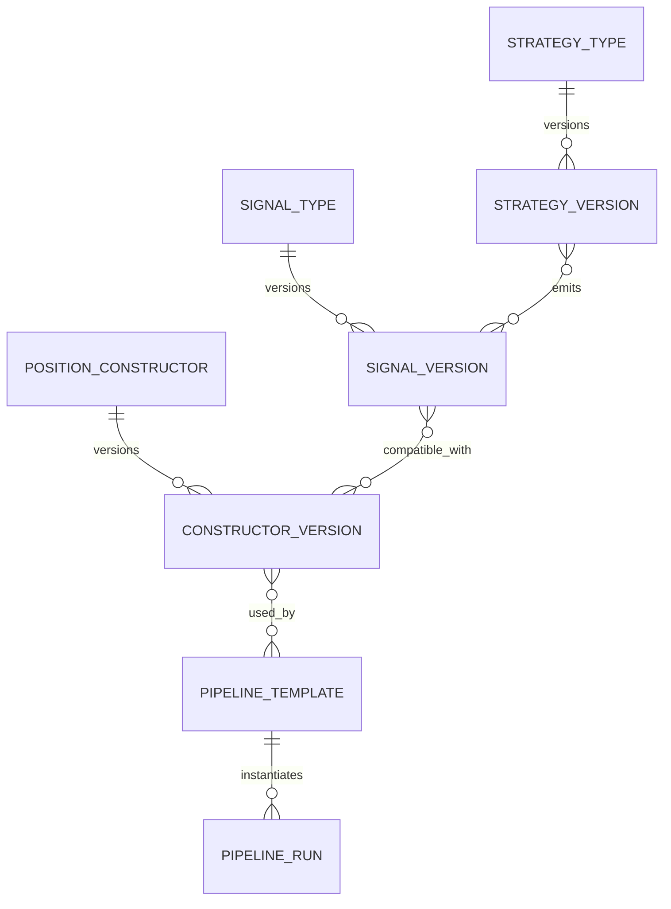
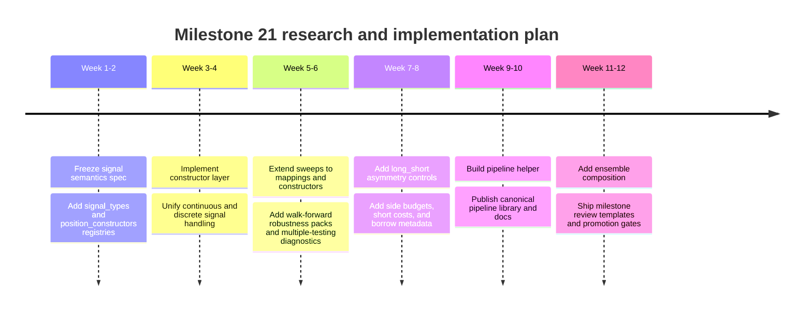

# StratLake Milestone 21 Research Report

## Executive Summary

**Connectors used:** the enabled GitHub connector for the selected repository, plus public web sources for market-structure and research-method references.

The selected repository already has a strong deterministic research core: built-in strategies and alpha models, explicit signal generation and alpha-to-signal mapping, a lagged-execution backtest runner, portfolio construction, robustness sweeps, and a Milestone 20 YAML-driven pipeline runner with manifest, lineage, state, and registry outputs. What it does **not** yet have is a first-class abstraction layer for **strategy archetypes**, **signal semantics**, and **position constructors** that can be registered, versioned, searched, and composed through a high-level pipeline helper. That missing layer is the main Milestone 21 opportunity. [1] [2] [3] [4] [5] [6]

My central recommendation is to treat Milestone 21 as a **semantic standardization milestone** rather than “just add more models.” Concretely, StratLake should add three registry-backed libraries: `strategy_types`, `signal_types`, and `position_constructors`. Each entry should be versioned, auditable, schema-validated, and pipeline-addressable. The existing pipeline runner and CLI adapter are already close to what is needed operationally; the gap is that current YAML steps reference modules and raw CLI flags, not reusable typed research objects. [7] [5] [8]

The repository’s current research surface is also **unevenly richer on alpha than on strategy archetypes**. On the strategy side, the built-in layer is still centered on momentum, mean reversion, and buy-and-hold. On the alpha side, the repo already supports cross-sectional linear, ridge, Elastic Net, XGBoost, LightGBM, and rank-composite models, along with four explicit signal-mapping policies. Milestone 21 should therefore expand the *library of archetypes* and then make both strategy and alpha outputs pass through the same semantic signal and position-construction layer. [9] [10] [11] [2]

The external research strongly supports broadening the canonical strategy set to include cross-sectional momentum, time-series momentum, reversal, pairs/stat-arb, value/carry, and model-based cross-sectional ranking. It also strongly supports **multiple-testing controls** for strategy sweeps: the classic data-snooping warning from Halbert White, the SPA refinement from Peter R. Hansen, and the deflated-Sharpe approach from David H. Bailey and Marcos Lopez de Prado are especially relevant if Milestone 21 adds broad parameter, signal, and constructor sweeps. [12]

The near-term implementation order should be: **unify signal semantics**, **add explicit position constructors**, **encode long/short asymmetry**, **extend robustness sweeps beyond strategy parameters**, and **wrap it all in a pipeline helper that emits current-style YAML pipeline specs**. That sequence gives the most leverage with the least architectural churn because it builds directly on the current deterministic CLI and artifact model rather than replacing it. [13] [14] [3] [4] [15]

## Repository Audit

The repository describes itself as a deterministic research platform rather than a live-trading stack, which is the right framing for Milestone 21: the work should optimize for auditable semantics, reusable libraries, and reproducible search rather than low-latency execution. [1]

| Surface | What exists now | Why it matters for Milestone 21 | Main gap |
|---|---|---|---|
| Strategy implementations | Built-in research strategies are centered on **momentum**, **mean reversion**, and **buy-and-hold**, with config-driven construction. [9] [16]| There is already a clean deterministic strategy contract. | No canonical library for breakout, carry, pairs/stat-arb, value, residual momentum, or regime-aware variants. |
| Alpha models | Built-ins support cross-sectional **linear**, **ridge**, **Elastic Net**, **XGBoost**, **LightGBM**, and **rank composite** models; config catalogs already exist for baseline and Q1 2026 alpha sets. [17] [18] [10] [11] | Alpha coverage is already broader than strategy coverage. | Alpha outputs are not yet normalized into a first-class signal/constructor registry architecture. |
| Signal mappings | Alpha mapping policies currently include `rank_long_short`, `zscore_continuous`, `top_bottom_quantile`, and `long_only_top_quantile`. [2] | This is the embryo of a signal semantics system. | No typed `signal_type` registry, no declared compatibility matrix, no side-budget metadata, and no persistent semantic IDs. |
| Strategy signal engine | Strategy-side signal generation validates discrete `{-1,0,1}` signals by default. [14] [19] | Good for simple baselines. | It conflicts with the backtest layer’s ability to accept continuous exposures, creating a semantics mismatch between strategy and alpha paths. |
| Backtest position semantics | The backtest runner interprets finite numeric signals as **literal lagged exposures**, with no implicit clipping or normalization. [3] | This is powerful and flexible. | There is no explicit “position constructor” boundary between raw signals and executable positions. |
| Alpha sleeve construction | Alpha sleeves backtest mapped signals, then aggregate sleeve returns by timestamp using the mean across active symbols. [20] | Good deterministic baseline for alpha-to-portfolio wiring. | This is a hidden constructor choice; it should become a named, registered constructor rather than an implicit convention. |
| Candidate allocation | Candidate governance currently only enables `equal_weight`; `max_sharpe` and `risk_parity` are explicitly blocked in candidate allocation for now. [21] | This keeps milestone-15 governance conservative. | It also means constructor richness does not exist at the candidate-selection layer yet. |
| Portfolio optimization | Portfolio workflows support `equal_weight`, `max_sharpe`, and `risk_parity`, plus operational volatility targeting. [1] [22] | Good downstream allocator layer already exists. | Upstream signal-to-position logic is still under-specified relative to downstream optimization. |
| Robustness sweeps | Robustness supports cartesian parameter sweeps, single-window or walk-forward stability, threshold pass rates, neighbor-gap analysis, and deterministic ranking. [4] [23] | Excellent base for search infrastructure. | Sweeps are strategy-parameter-centric; they do not yet sweep signal mappings, constructor choices, asymmetry rules, or ensemble recipes. |
| Pipeline orchestration | The YAML pipeline runner supports DAG ordering, state updates, manifests, lineage, metrics, and a pipeline registry. [5] [8] [6] | Operationally, the repo is ready for broader research composition. | Authoring is still low-level: no helper that builds pipelines from registry objects. |
| Config schemas | The repo already has separate YAML surfaces for strategies, alphas, portfolios, robustness, and pipelines. [10] [11] [13] [23] | This is enough structure to support Milestone 21. | There is no dedicated JSONL registry for `strategy_types`, `signal_types`, and `position_constructors`. |

The most important technical inconsistency is the split between **strategy-side discrete signals** and **backtest-side continuous exposures**. Strategy generation still validates against `{-1,0,1}`, while the backtest runner explicitly allows any finite numeric exposure and alpha mappings already include continuous z-score signals. Milestone 21 should remove that ambiguity by making signal semantics explicit and registry-backed. [14] [19] [2] [3]

## Canonical Strategy and Signal Library

The recommended library should start from archetypes that are both academically established and operationally distinct. Cross-sectional momentum was formalized by Narasimhan Jegadeesh and Sheridan Titman, time-series momentum by Tobias J. Moskowitz, Yao Hua Ooi, and Lasse Heje Pedersen, long-horizon reversal by Werner F. M. De Bondt and Richard H. Thaler, pairs trading by Evan Gatev, William N. Goetzmann, and K. Geert Rouwenhorst, and value/carry across assets by Clifford S. Asness and collaborators. [12]

The current repo already covers pieces of this space through momentum, mean reversion, rank-composite momentum, and cross-sectional ML alphas, but Milestone 21 should turn that partial coverage into a canonical registered library. [9] [10] [11]

| Archetype | Math definition | Inputs | Example params | Recommended signal semantics | Typical failure modes |
|---|---|---|---|---|---|
| Time-series momentum | \( s_{i,t} = \mathrm{sign}\left(\sum_{k=1}^{L} r_{i,t-k}\right) \) or SMA crossover | per-symbol returns or prices | lookback 20/60/120; delay 1 bar | `ternary_long_short`, `signed_zscore` | momentum crashes, reversal regimes, crowded exits |
| Cross-sectional momentum | \( s_{i,t} = \mathrm{rank}(r^{(L)}_{i,t}) \) within timestamp | cross-section of trailing returns | lookback 20/63/126; rebalance daily/weekly | `cross_section_rank`, `ternary_quantile` | factor crowding, sector concentration, momentum crashes |
| Mean reversion | \( s_{i,t} = -\mathrm{clip}(z_{i,t},-c,c) \), \( z_{i,t}=(p_{i,t}-\mu_{L})/\sigma_{L} \) | price, moving average, rolling vol | lookback 5/20/60; entry 1.0–2.0σ | `signed_zscore`, `binary_top_quantile` | trend regimes, whipsaw, microstructure noise |
| Pairs / spread reversion | \( z_t = (x_t-\beta y_t-\mu)/\sigma \), trade \(-z_t\) | paired prices, hedge ratio, spread vol | formation 60/120; entry 1.5–2.5σ | `spread_zscore`, `target_weight` | cointegration breaks, borrow frictions, hard-to-borrow shorts |
| Value / carry | \( s_{i,t} = \mathrm{rank}(v_{i,t}) \) or \( \mathrm{rank}(carry_{i,t}) \) | valuation or carry features | rebalance monthly; winsorize 1–2% | `cross_section_rank`, `ternary_quantile`, `long_only_quantile` | slow convergence, structural shifts, sector tilts |
| Residual momentum | \( s_{i,t} = \mathrm{rank}(\hat{\epsilon}^{(L)}_{i,t}) \) after factor residualization | returns plus factor exposures | lookback 63/126; residual model refresh monthly | `cross_section_rank`, `target_weight` | factor model instability, residual noise |
| Breakout / channel trend | \( s_{i,t} = \mathbf{1}[p_t>\max(p_{t-L:t-1})]-\mathbf{1}[p_t<\min(\cdot)] \) | prices, rolling extrema | channel 20/55/100 | `binary_long_only`, `ternary_long_short` | false breaks, volatility clustering |
| Cross-sectional ML ranking | \( s_{i,t}=f_\theta(x_{i,t}) \) with explicit mapping to executable semantics | features, target, train/predict windows | model family; horizon; mapping policy; calibration | `prediction_score`, `cross_section_rank`, `target_weight` | leakage, unstable IC, overfitting, regime drift |

The signal library should then formalize the *meaning* of outputs before they hit backtests or portfolios. The repo already has the right basic operations in `src/research/alpha/signals.py`; Milestone 21 should promote them into versioned semantic types. [2]

| Signal type | Transformation | Native range | Validation rules | Default constructor |
|---|---|---|---|---|
| `prediction_score` | raw model output \(f_\theta(x)\) | unbounded real | finite, no NaN, duplicate-free `(symbol, ts_utc)` | `zscore_clip_scale` |
| `cross_section_rank` | normalized descending rank within each timestamp | \([-1,1]\) | at least 2 assets per cross-section; deterministic tie-breaker | `rank_dollar_neutral` |
| `cross_section_percentile` | percentile or quantile score within timestamp | \([0,1]\) | monotone mapping metadata must be declared | `softmax_long_only` |
| `signed_zscore` | centered and scaled score | real, typically clipped | zero-variance handling; optional clip threshold | `zscore_clip_scale` |
| `ternary_quantile` | top/bottom quantile mapped to \(\{-1,0,1\}\) | \{-1,0,1\} | `0 < q <= 0.5`; non-empty side counts | `top_bottom_equal_weight` |
| `binary_top_quantile` | top-quantile mapped to \(\{0,1\}\) | \{0,1\} | `0 < q <= 1`; non-empty selected set | `softmax_long_only` or `equal_weight_long_only` |
| `spread_zscore` | residual or spread score for paired trade | real | hedge-ratio provenance required | `pairs_beta_neutral` |
| `target_weight` | already-constructed position target | bounded real vector | gross/net/beta budget declarations required | `identity_weights` |

## Position Construction, Registry, and Pipeline Helper

The current repo already contains three implicit constructor layers: backtest exposures are taken literally from numeric signals, alpha sleeves aggregate cross-sectional results by timestamp mean, and candidate selection only allocates via equal weight even though the downstream portfolio layer supports richer optimizers. That is enough evidence that StratLake needs a **named constructor layer** in between signal semantics and execution. [3] [20] [21] [22]

| Constructor | Formula | Inputs | Compatible signal types | Long/short asymmetry handling |
|---|---|---|---|---|
| `identity_weights` | \( w_{i,t}=s_{i,t} \) | target weights | `target_weight` | none; use only when semantics already fully specified |
| `rank_dollar_neutral` | normalize positive and negative ranks separately so \( \sum w^+ = g_L \), \( \sum |w^-| = g_S \), \( \sum w = 0 \) | ranks, gross budgets | `cross_section_rank` | separate long and short gross budgets |
| `top_bottom_equal_weight` | \( w_i \in \{+g_L/k_L,0,-g_S/k_S\} \) | ternary quantile signal, side counts | `ternary_quantile` | explicit unequal \(g_L\) and \(g_S\) budgets |
| `softmax_long_only` | \( w_i = \exp(\tau s_i)/\sum_j \exp(\tau s_j) \) over selected longs | scores or percentiles | `cross_section_percentile`, `binary_top_quantile` | long-only |
| `zscore_clip_scale` | \( w_i = \mathrm{clip}(s_i/c,-1,1) \), then gross-normalize | z-scores or raw scores | `signed_zscore`, `prediction_score` | side caps and side-level normalization |
| `pairs_beta_neutral` | solve \(w_a + \beta w_b = 0\) with spread-sized gross | spread score, hedge ratio | `spread_zscore` | short-side borrow and locate flags should be carried in metadata |
| `inverse_vol_budgeted` | \( w_i \propto s_i/\sigma_i \) under gross/net constraints | signal, rolling vol | `target_weight`, `cross_section_rank`, `signed_zscore` | side-level gross limits and optional short haircut |
| `erc_overlay` | equalize marginal risk contributions subject to signal sign constraints | covariance estimate, seed weights | `target_weight` | side-specific gross and leverage caps |
| `turnover_projected` | project \(w_t^\*\) onto \( \|w_t-w_{t-1}\|_1 \le \tau \) | target weights, previous weights | any constructor output | separate turnover budgets by side or by book |

For long/short asymmetry specifically, the repo today is still essentially **symmetric**: transaction costs and slippage are applied from absolute position change, but there is no short-borrow model, locate availability, side-specific leverage, or short-only risk budget. The right Milestone 21 design is therefore not to “hard-code short selling rules” into every strategy, but to add asymmetry into constructors and validation metadata: `gross_long`, `gross_short`, `short_borrow_bps`, `max_short_names`, `hard_to_borrow_policy`, `beta_neutrality`, and `short_recall_policy`. That recommendation follows directly from the current repo’s literal exposure semantics and its already-separate runtime/risk layers. [3] [22]

The registry design should mirror the versioning, tagging, and lineage ideas used in mature model registries while staying consistent with StratLake’s JSONL-and-manifest style. Versioning, aliases, tags, and lineage are exactly the kinds of fields that registry systems use when they need reproducibility and controlled promotion. [24] [6] [25]



**Recommended example JSONL entries**

```json
{"object_type":"strategy_type","strategy_id":"ts_momentum_sma","version":"1.0.0","status":"active","archetype":"time_series_momentum","implementation":{"module":"src.research.strategies.builtins","factory":"MomentumStrategy"},"input_schema":{"required_columns":["symbol","ts_utc","close"],"timeframe":["1D","1Min"]},"output_signal_type":"cross_section_rank","default_position_constructor":"rank_dollar_neutral","parameter_schema":{"short_window":{"type":"int","min":2},"long_window":{"type":"int","min":3}},"tags":["baseline","trend","deterministic"]}
{"object_type":"signal_type","signal_type_id":"ternary_quantile","version":"1.0.0","status":"active","domain":"cross_section_score","codomain":"{-1,0,1}","transform":{"policy":"top_bottom_quantile","params":["quantile"]},"validation":{"quantile_min":0.0,"quantile_max":0.5,"requires_cross_section_size_gte":2},"compatible_position_constructors":["top_bottom_equal_weight","inverse_vol_budgeted"]}
{"object_type":"position_constructor","constructor_id":"rank_dollar_neutral","version":"1.0.0","status":"active","inputs":["cross_section_rank"],"formula":"normalize positive and negative ranks separately to configured gross budgets","parameters":{"gross_long":{"type":"float","default":0.5},"gross_short":{"type":"float","default":0.5},"beta_neutral":{"type":"bool","default":false}},"risk_flags":["long_short","gross_capped","side_budgeted"]}
```

The pipeline helper should be a **builder that emits current pipeline specs**, not a second orchestration engine. The repo already standardizes around `run_cli(argv, state, pipeline_context)` and `build_pipeline_cli_result(...)`; Milestone 21 should keep that contract and add a higher-level authoring layer on top. [7] [5]

```python
from src.pipeline.helper import PipelineBuilder

pipe = (
    PipelineBuilder("m21_xgb_quantile_portfolio")
    .alpha(
        alpha_name="ml_cross_sectional_xgb_2026_q1",
        config="configs/alphas_2026_q1.yml",
        signal_type="ternary_quantile",
        signal_params={"quantile": 0.20},
    )
    .construct_positions(
        constructor="top_bottom_equal_weight",
        params={"gross_long": 0.5, "gross_short": 0.5}
    )
    .candidate_selection(metric="ic_ir", max_candidates=3, allocation_method="equal_weight")
    .portfolio(name="m21_xgb_q20_equal", timeframe="1D")
)

spec_path = pipe.write_yaml("configs/pipelines/m21_xgb_quantile_portfolio.yml")
pipe.run()
```

```bash
python -m src.cli.run_pipeline --config configs/pipelines/m21_xgb_quantile_portfolio.yml
```

## Research Plan and Example Pipelines

The repo’s existing robustness machinery is a very good base, but Milestone 21 should broaden search to three axes: **strategy parameters**, **signal semantics**, and **position constructors**. Once you do that, multiple-testing control becomes mandatory rather than optional. The most defensible sequence is: broad candidate generation, deterministic walk-forward or subperiod scoring, then post-search filters such as Reality Check, SPA, and Deflated Sharpe. [4] [23] [26]



The following five pipeline specs are the best initial library. The last one already exists in the repo; the other four are designed to run unchanged once saved at the indicated repo paths because they reuse current module boundaries. [15]

| Suggested path | Purpose | Core steps | Run command |
|---|---|---|---|
| `configs/pipelines/m21_strategy_baselines.yml` | Baseline strategy library smoke test | `src.cli.run_strategy` for `momentum_v1`, `mean_reversion_v1_safe_2026_q1`, then `src.cli.compare_strategies` | `python -m src.cli.run_pipeline --config configs/pipelines/m21_strategy_baselines.yml` |
| `configs/pipelines/m21_alpha_model_zoo.yml` | Canonical alpha library comparison | `src.cli.run_alpha` for rank composite, XGB, LGBM, Elastic Net, then `src.cli.compare_alpha` | `python -m src.cli.run_pipeline --config configs/pipelines/m21_alpha_model_zoo.yml` |
| `configs/pipelines/m21_alpha_to_candidate_portfolio.yml` | Alpha-to-candidate-to-portfolio path | alpha runs → `compare_alpha` → `run_candidate_selection` → `run_portfolio` | `python -m src.cli.run_pipeline --config configs/pipelines/m21_alpha_to_candidate_portfolio.yml` |
| `configs/pipelines/m21_robustness_sweep.yml` | Strategy and mapping sweep pack | `src.cli.run_strategy --robustness` plus multiple strategy entries and result collection | `python -m src.cli.run_pipeline --config configs/pipelines/m21_robustness_sweep.yml` |
| `configs/pipelines/m21_signal_constructor_matrix.yml` | Signal/constructor compatibility matrix | repeated `run_alpha` or `run_strategy` steps with alternate signal policies / constructors, then portfolio comparison | `python -m src.cli.run_pipeline --config configs/pipelines/m21_signal_constructor_matrix.yml` |
| `configs/pipelines/scenario_matrix_pipeline.yml` | Existing repo-wide scenario baseline | alpha runs, strategy runs, comparisons, candidate selection, portfolio | `python -m src.cli.run_pipeline --config configs/pipelines/scenario_matrix_pipeline.yml` |

A good sweep protocol for all of these pipelines is: generate all variants deterministically; score them using walk-forward or subperiod panels; keep raw leaderboard outputs; then compute **best-vs-benchmark**, **stability**, **neighbor sensitivity**, **threshold pass rate**, **DSR**, and **SPA/Reality Check** before any promotion decision. That preserves StratLake’s current artifact-driven auditability while materially reducing sweep overfitting risk. [4] [26]

## Prioritized Roadmap

| Horizon | Deliverable | Estimated effort | Main risks | Why this priority |
|---|---|---:|---|---|
| Short term | Add `signal_types.jsonl`, `position_constructors.jsonl`, and `strategy_types.jsonl` plus schema validation | 1–2 engineer-weeks | schema churn, over-design | Highest leverage; unlocks everything else |
| Short term | Unify strategy and alpha signal semantics so both can emit continuous or discrete types explicitly | 1–2 engineer-weeks | backward-compatibility breaks in tests | Removes the repo’s largest semantic inconsistency |
| Short term | Implement first constructor library: `identity_weights`, `top_bottom_equal_weight`, `rank_dollar_neutral`, `softmax_long_only`, `zscore_clip_scale` | 2–3 engineer-weeks | hidden assumptions in existing sleeves/backtests | Turns implicit conventions into auditable components |
| Medium term | Extend robustness/search to sweep signal mappings, constructors, and ensemble recipes | 2–4 engineer-weeks | combinatorial explosion | Builds directly on the existing robustness framework |
| Medium term | Add long/short asymmetry controls: side budgets, short cost metadata, borrow flags, side turnover caps | 2–3 engineer-weeks | increased config complexity | Necessary if the platform is to support serious long/short research |
| Medium term | Add multiple-testing diagnostics: DSR, Reality Check, SPA summaries in artifacts | 1–2 engineer-weeks | statistical implementation quality | Essential once search breadth expands |
| Long term | Add ensemble composition registry and portfolio-of-signals pipelines | 3–5 engineer-weeks | attribution complexity, correlation instability | Best way to convert a larger strategy library into more robust portfolios |
| Long term | Ship `PipelineHelper` builder, registry-aware docs, and a documented library/registry browser | 2–4 engineer-weeks | authoring ergonomics vs. abstraction creep | Makes the new library usable by non-core developers |

If Milestone 21 ships only three things, they should be these: **a canonical signal semantics spec, a first-class position constructor library, and a pipeline helper that addresses these by registry ID instead of raw CLI wiring**. That sequence strengthens the current repo without discarding its existing deterministic CLI, artifact, and registry architecture. [13] [7] [5]

## References

[1] [README.md — Project Overview & System Architecture](https://github.com/christophermoverton/stratlake-trade-engine/blob/main/README.md)  
High-level documentation describing the StratLake Trade Engine architecture, workflow design, and deterministic research philosophy.

[2] [signals.py — Alpha Signal Generation Layer](https://github.com/christophermoverton/stratlake-trade-engine/blob/main/src/research/alpha/signals.py)  
Implements feature-to-signal transformations, forming the foundation of alpha construction and downstream evaluation.

[3] [backtest_runner.py — Backtesting Engine](https://github.com/christophermoverton/stratlake-trade-engine/blob/main/src/research/backtest_runner.py)  
Core execution engine responsible for simulating strategy performance with strict temporal integrity and no lookahead bias.

[4] [robustness.py — Strategy Robustness & Stability Analysis](https://github.com/christophermoverton/stratlake-trade-engine/blob/main/src/research/robustness.py)  
Provides sensitivity analysis, parameter sweeps, and robustness validation to assess strategy durability across scenarios.

[5] [pipeline_runner.py — Pipeline Orchestration Engine](https://github.com/christophermoverton/stratlake-trade-engine/blob/main/src/pipeline/pipeline_runner.py)  
Coordinates multi-stage workflows (features → alpha → evaluation → portfolio), enabling reproducible, end-to-end execution.

[6] [registry.py — Pipeline & Artifact Registry](https://github.com/christophermoverton/stratlake-trade-engine/blob/main/src/pipeline/registry.py)  
Manages registration, versioning, and retrieval of pipelines and artifacts, supporting deterministic reproducibility.

[7] [cli_adapter.py — CLI Integration Layer](https://github.com/christophermoverton/stratlake-trade-engine/blob/main/src/pipeline/cli_adapter.py)  
Bridges pipeline execution with command-line interfaces, enabling structured and parameterized workflow execution.

[8] [run_pipeline.py — Pipeline Execution Entrypoint](https://github.com/christophermoverton/stratlake-trade-engine/blob/main/src/cli/run_pipeline.py)  
Primary CLI entrypoint for executing full pipeline workflows with runtime configuration overrides.

[9] [builtins.py — Built-in Strategy Definitions](https://github.com/christophermoverton/stratlake-trade-engine/blob/main/src/research/strategies/builtins.py)  
Collection of predefined strategies used for benchmarking, experimentation, and validation.

[10] [alphas.yml — Alpha Configuration Registry](https://github.com/christophermoverton/stratlake-trade-engine/blob/main/configs/alphas.yml)  
Defines available alpha models, configurations, and parameter spaces used during training and evaluation.

[11] [alphas_2026_q1.yml — Alpha Experiment Configuration](https://github.com/christophermoverton/stratlake-trade-engine/blob/main/configs/alphas_2026_q1.yml)  
Snapshot of alpha configurations for a specific experimental cycle, enabling reproducible research runs.

[12] [Fama & French (1993) — Risk Factor Model Foundation](https://colab.ws/articles/10.1111/j.1540-6261.1993.tb04702.x)  
Seminal academic work establishing multi-factor asset pricing models, foundational to modern alpha research.

[13] [run_strategy.py — Strategy Execution CLI](https://github.com/christophermoverton/stratlake-trade-engine/blob/main/src/cli/run_strategy.py)  
CLI entrypoint for running individual strategies, including evaluation, benchmarking, and artifact generation.

[14] [signal_engine.py — Signal Processing Engine](https://github.com/christophermoverton/stratlake-trade-engine/blob/main/src/research/signal_engine.py)  
Transforms raw model outputs into tradable signals with proper alignment and validation.

[15] [scenario_matrix_pipeline.yml — Scenario Sweep Definition](https://github.com/christophermoverton/stratlake-trade-engine/blob/main/configs/pipelines/scenario_matrix_pipeline.yml)  
Defines multi-scenario execution matrices for robustness testing across datasets, parameters, and configurations.

[16] [strategies/registry.py — Strategy Registry](https://github.com/christophermoverton/stratlake-trade-engine/blob/main/src/research/strategies/registry.py)  
Registers and resolves available strategies for dynamic selection and execution.

[17] [alpha/catalog.py — Alpha Model Catalog](https://github.com/christophermoverton/stratlake-trade-engine/blob/main/src/research/alpha/catalog.py)  
Central catalog for discovering, organizing, and managing alpha models within the system.

[18] [alpha/builtins.py — Built-in Alpha Models](https://github.com/christophermoverton/stratlake-trade-engine/blob/main/src/research/alpha/builtins.py)  
Predefined alpha model implementations used for baseline comparisons and experimentation.

[19] [integrity.py — Research Integrity & Validation Layer](https://github.com/christophermoverton/stratlake-trade-engine/blob/main/src/research/integrity.py)  
Enforces strict data validation, anti-leakage constraints, and fail-fast guarantees across workflows.

[20] [alpha_eval/sleeves.py — Alpha Sleeve Construction](https://github.com/christophermoverton/stratlake-trade-engine/blob/main/src/research/alpha_eval/sleeves.py)  
Converts alpha signals into tradable sleeves with performance tracking and evaluation metrics.

[21] [candidate_selection/allocation.py — Portfolio Allocation Engine](https://github.com/christophermoverton/stratlake-trade-engine/blob/main/src/research/candidate_selection/allocation.py)  
Implements portfolio construction logic including weighting, selection, and optimization strategies.

[22] [run_portfolio.py — Portfolio Execution CLI](https://github.com/christophermoverton/stratlake-trade-engine/blob/main/src/cli/run_portfolio.py)  
CLI entrypoint for constructing and evaluating portfolios from selected strategies or alpha sleeves.

[23] [config/robustness.py — Robustness Configuration Layer](https://github.com/christophermoverton/stratlake-trade-engine/blob/main/src/config/robustness.py)  
Defines configuration schemas and thresholds for robustness testing and validation workflows.

[24] [research/registry.py — Research Artifact Registry](https://github.com/christophermoverton/stratlake-trade-engine/blob/main/src/research/registry.py)  
Tracks and persists research artifacts, ensuring reproducibility and auditability across experiments.

[25] [MLflow Model Registry — Industry Model Management Reference](https://mlflow.org/docs/latest/ml/model-registry/)  
Reference system for model lifecycle management, analogous to registry patterns used in StratLake.

[26] [White (2000) — Reality Check for Data Snooping](https://www.econometricsociety.org/publications/econometrica/2000/09/01/reality-check-data-snooping)  
Statistical framework addressing data-snooping bias, foundational to robust strategy validation.


[1]: https://github.com/christophermoverton/stratlake-trade-engine/blob/main/README.md
[2]: https://github.com/christophermoverton/stratlake-trade-engine/blob/main/src/research/alpha/signals.py
[3]: https://github.com/christophermoverton/stratlake-trade-engine/blob/main/src/research/backtest_runner.py
[4]: https://github.com/christophermoverton/stratlake-trade-engine/blob/main/src/research/robustness.py
[5]: https://github.com/christophermoverton/stratlake-trade-engine/blob/main/src/pipeline/pipeline_runner.py
[6]: https://github.com/christophermoverton/stratlake-trade-engine/blob/main/src/pipeline/registry.py
[7]: https://github.com/christophermoverton/stratlake-trade-engine/blob/main/src/pipeline/cli_adapter.py
[8]: https://github.com/christophermoverton/stratlake-trade-engine/blob/main/src/cli/run_pipeline.py
[9]: https://github.com/christophermoverton/stratlake-trade-engine/blob/main/src/research/strategies/builtins.py
[10]: https://github.com/christophermoverton/stratlake-trade-engine/blob/main/configs/alphas.yml
[11]: https://github.com/christophermoverton/stratlake-trade-engine/blob/main/configs/alphas_2026_q1.yml
[12]: https://colab.ws/articles/10.1111/j.1540-6261.1993.tb04702.x
[13]: https://github.com/christophermoverton/stratlake-trade-engine/blob/main/src/cli/run_strategy.py
[14]: https://github.com/christophermoverton/stratlake-trade-engine/blob/main/src/research/signal_engine.py
[15]: https://github.com/christophermoverton/stratlake-trade-engine/blob/main/configs/pipelines/scenario_matrix_pipeline.yml
[16]: https://github.com/christophermoverton/stratlake-trade-engine/blob/main/src/research/strategies/registry.py
[17]: https://github.com/christophermoverton/stratlake-trade-engine/blob/main/src/research/alpha/catalog.py
[18]: https://github.com/christophermoverton/stratlake-trade-engine/blob/main/src/research/alpha/builtins.py
[19]: https://github.com/christophermoverton/stratlake-trade-engine/blob/main/src/research/integrity.py
[20]: https://github.com/christophermoverton/stratlake-trade-engine/blob/main/src/research/alpha_eval/sleeves.py
[21]: https://github.com/christophermoverton/stratlake-trade-engine/blob/main/src/research/candidate_selection/allocation.py
[22]: https://github.com/christophermoverton/stratlake-trade-engine/blob/main/src/cli/run_portfolio.py
[23]: https://github.com/christophermoverton/stratlake-trade-engine/blob/main/src/config/robustness.py
[24]: https://github.com/christophermoverton/stratlake-trade-engine/blob/main/src/research/registry.py
[25]: https://mlflow.org/docs/latest/ml/model-registry/
[26]: https://www.econometricsociety.org/publications/econometrica/2000/09/01/reality-check-data-snooping